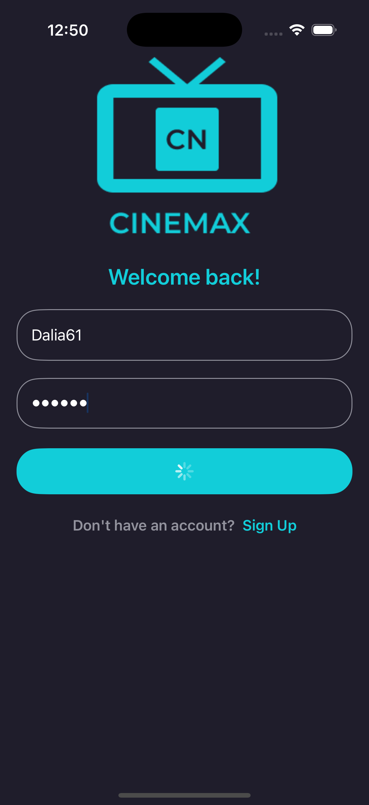
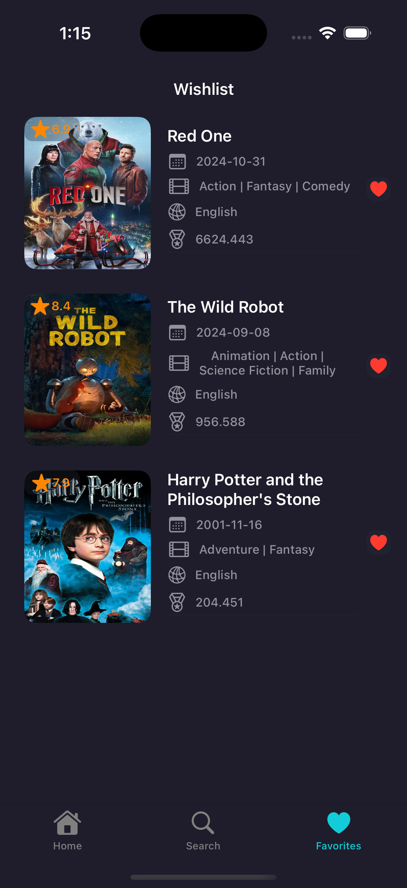
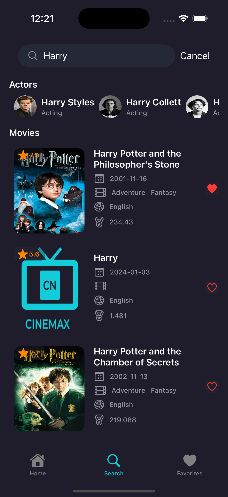

# CINEMAX

CINEMAX is a mobile application that provides detailed information about movies, series, and actors using the TMDb API. It offers a seamless experience for users to explore movie details, search for actors, and create personalized favorites lists.

## Table of Contents
- [Overview](#overview)
- [Getting Started](#getting-started)
- [Key Features](#key-features)
- [Technologies Used](#technologies-used)
- [Screenshots](#screenshots)
- [App Architecture](#app-architecture)
- [Authors](#authors)

---

## Overview

CINEMAX is designed for movie enthusiasts to:
- Browse upcoming and popular movies.
- View detailed information about actors and films.
- Create and manage a favorites list.
- Search for movies and actors with ease.

---

## Getting Started

Follow these steps to set up and run the CINEMAX app:

1. Clone the repository:
   ```bash
   git clone https://github.com/dalia61/CINEMAX.git
   cd CINEMAX
   ```
2. Open the project in Xcode.
3. Build and run the app on a simulator or physical device.

---

## Key Features

### User Account Management
- **Sign Up**: Create a new account with username, password, name, and email.
  
- **Login**: Authenticate users to access the app.

### Movie Exploration
- **Home Screen**: Displays upcoming movies, popular movies, and actors.

- **Movie List**: View movie cards with essential details. Sort movies by popularity, rating, or release date.

- **Movie Details**: Provides comprehensive details like release date, genres, runtime, trailers, and cast.

### Actor Information
- **Actor List**: View actor cards with essential details like name, place of birth, and popularity.

- **Actor Details**: Explore actor biographies, filmographies, and associated movies or series.

### Search and Favorites
- **Search Screen**: Quickly find movies or actors using keywords.

- **Favorites**: Save movies to a wishlist for easy access.


---

## Technologies Used

- **Programming Language**: Swift
- **UI Frameworks**: UIKit and SwiftUI
- **Architecture**: Clean Architecture with MVVM and Combine
- **Design Tool**: Figma
- **API**: TMDb for fetching movie and actor data

---

## Screenshots

### Launch Screen
- **Launch Screen**
  
  

### User Screens
- **Sign Up**
  
  
  
- **Login**
  
  
  
- **Home Screen**
  
  
  

### Movie Screens
- **Movie List**
  
  
  
- **Movie Details**
  
  
  

### Actor Screens
- **Actor List**
  
  
  
- **Actor Details**
  
  

### Additional Screens
- **Favorites**
  
  
  
- **Search**
  
  
  

---

## App Architecture

The project is modular, organized as follows:

```
CINEMAX/
├── App/
│   ├── AppDelegate
│   ├── Configuration
│   ├── DesignKit
│   ├── Foundation/
│   │   ├── ContentView
│   │   ├── DataPersistence
│   │   ├── Networking
│   ├── Resources
├── SharedData/
│   ├── DataSources
│   ├── EndPoints
│   ├── Repos
├── SharedDomain/
│   ├── Repo
├── Scenes/
│   ├── SignUp/
│   │   ├── Domain/
│   │   │   ├── Entities
│   │   │   ├── UseCases
│   │   ├── Presentation/
│   │       ├── View
│   │       ├── ViewModel
│   ├── (Other scenes follow the same structure)
```

---

## Authors

Developed by:
- **Dalia Hamada**  
  [LinkedIn Profile](https://www.linkedin.com/in/daliahamada/)

---

